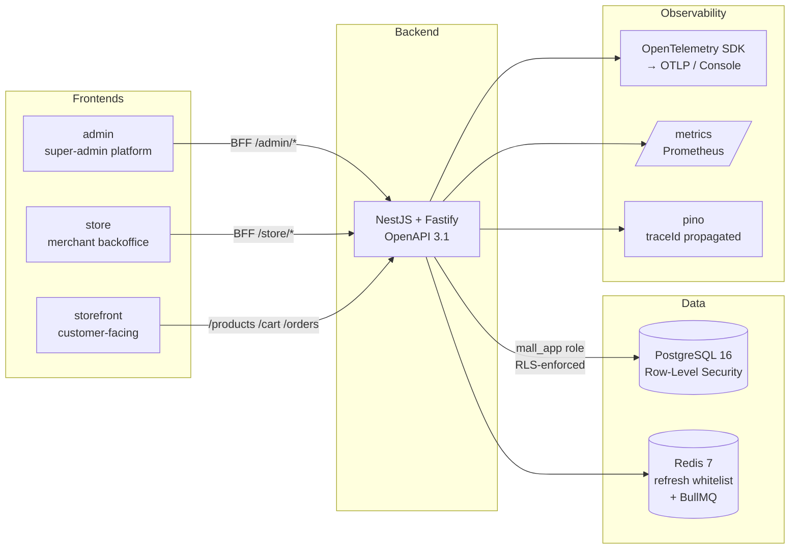

[English](./README.en.md) · [简体中文](./README.md)

# mall-saas

> Multi-tenant SaaS e-commerce reference stack: NestJS 11 + Fastify + Prisma 7 + PostgreSQL RLS + three frontends (admin / store / storefront) + W3C Trace Context + OpenTelemetry.

[](https://github.com/can4hou6joeng4/mall-saas/actions/workflows/ci.yml)
[](https://github.com/can4hou6joeng4/mall-saas/actions/workflows/release.yml)
[](https://github.com/can4hou6joeng4/mall-saas/actions/workflows/codeql.yml)
[](./LICENSE)
[](https://github.com/can4hou6joeng4/mall-saas/stargazers)
[](https://github.com/can4hou6joeng4/mall-saas/pkgs/container/mall-api)
[](https://github.com/can4hou6joeng4/mall-saas/discussions)
[](https://github.com/can4hou6joeng4/mall-saas/issues?q=is%3Aissue+is%3Aopen+label%3A%22good+first+issue%22)

A multi-tenant SaaS e-commerce engineering reference, focused on **tenant data isolation (Row-Level Security) + observability (full-chain trace) + end-to-end verifiability**.

## Architecture



## Tech Stack

| Layer | Choices |
|-------|---------|
| Backend | NestJS 11 · Fastify 5 · Prisma 7 · Zod validation · BullMQ queue · pino structured logs |
| Auth | JWT access + refresh dual tokens · Redis whitelist · scope=tenant/platform separation |
| Data isolation | PG Row-Level Security + `mall_app` non-superuser role · AsyncLocalStorage propagates tenantId |
| Payments | StripeProvider + MockProvider abstraction, HMAC webhook signatures + idempotent callbacks |
| Observability | W3C Trace Context (M24) · OpenTelemetry SDK + auto-instrumentation (M34) |
| i18n | Accept-Language → BusinessException dictionary (M17) · storefront EN/zh switcher (M33) |
| Frontends | Vite 6 + React 18 + TanStack Query + React Router 6 · openapi-typescript codegen |
| Build | pnpm workspace + turbo · ESLint + Prettier · exactOptionalPropertyTypes |
| Tests | vitest (138 e2e + unit) · Playwright (admin/store/storefront, 4 browser cases) |
| CI | GitHub Actions · shellcheck · turbo cache · acceptance-smoke · GHCR release |
| Deploy | docker compose (postgres + redis + api + migrate stage) · `.env.prod.example` |

## Quickstart

Requirements: Node 22+, pnpm 9+, Docker.

```bash
# 1. Start dependencies (postgres + redis)
docker compose up -d

# 2. Install deps + apply migrations
cp .env.example .env
pnpm install
pnpm --filter @mall/api exec prisma migrate deploy

# 3. Start the API
pnpm --filter @mall/api dev
# → http://localhost:3000/healthz
# → http://localhost:3000/docs       (Swagger UI)
# → http://localhost:3000/metrics    (Prometheus)

# 4. Start the three frontends (each in its own terminal)
pnpm --filter @mall/admin dev       # http://localhost:5173
pnpm --filter @mall/store dev       # http://localhost:5174
pnpm --filter @mall/storefront dev  # http://localhost:5175
```

## Common Commands

| Command | Purpose |
|---------|---------|
| `pnpm test` | All workspace unit tests + backend e2e |
| `pnpm lint` | ESLint (max-warnings=0) |
| `pnpm typecheck` | TypeScript strict mode |
| `pnpm build` | Build every workspace |
| `pnpm --filter @mall/storefront exec playwright test` | Browser-level e2e |
| `bash scripts/m{N}-acceptance.sh` | End-to-end milestone acceptance (M2–M34) |

## Deployment

Single-host production via docker compose:

```bash
cp .env.prod.example .env.prod
# Fill strong-random JWT_SECRET / POSTGRES_PASSWORD / PAYMENT_MOCK_SECRET ...
docker compose -f docker-compose.prod.yml --env-file .env.prod up -d --build
```

Images are also published to [GHCR](https://github.com/can4hou6joeng4/mall-saas/pkgs/container/mall-api) on every `v*` tag push:

```bash
docker pull ghcr.io/can4hou6joeng4/mall-api:latest
```

## Multi-Tenant Isolation (Core Design)

1. **JWT carries `tenantId`** — every tenant-scoped request is parsed by the `Auth` middleware and stored in AsyncLocalStorage.
2. **Dual PG roles**: `mall` (superuser, runs migrations) / `mall_app` (runtime, RLS-enforced).
3. **Every business table has an RLS policy**: `USING (tenant_id = current_setting('app.tenant_id')::int)`.
4. **Every transaction starts with `SET LOCAL app.tenant_id = $1`** (wrapped by `PrismaService.withTenant()`).
5. Even if application code forgets a `WHERE tenant_id`, the database refuses cross-tenant reads/writes — **the last line of defense**.

## Milestones

34 milestones from v0.2-m2 to v0.34-m34, each shipped with a runnable `scripts/m{N}-acceptance.sh`:

| Phase | Highlights |
|-------|-----------|
| Backend skeleton (M2 – M10) | RLS · multi-tenancy · products · orders · payments · JWT refresh |
| Business capability (M11 – M17) | cart · reserved stock · Stripe · coupons · file storage · i18n |
| Three frontends (M18 – M23) | admin Playwright · storefront · 401 auto-refresh · store details · customer payment |
| Observability & deploy (M24 – M30) | W3C trace · production compose · admin tenant/payment details · user management · GHCR release |
| Engineering polish (M31 – M34) | coupon end-to-end · three-frontend Playwright · storefront i18n · OpenTelemetry SDK |

Every milestone follows the same rhythm: feature branch → backend + e2e → frontend + jsdom → acceptance script → ff-merge → tag.

## Directory Layout

```
.
├── apps/
│   ├── api/           NestJS backend (OpenAPI 3.1, Prisma, BullMQ, OTel)
│   ├── admin/         super-admin frontend
│   ├── store/         merchant backoffice frontend
│   └── storefront/    customer frontend (i18n: EN / zh-CN)
├── packages/
│   └── shared/        shared branded types (TenantId etc.)
├── scripts/
│   └── m*-acceptance.sh  end-to-end acceptance script per milestone
├── docker-compose.yml         dev: postgres + redis
├── docker-compose.prod.yml    prod: postgres + redis + migrate + api
└── .github/workflows/
    ├── ci.yml         shellcheck + workspaces + docker-smoke + acceptance-smoke
    └── release.yml    on push tag v* → build & push GHCR
```

## Contributing & Roadmap

- Want to contribute? Read [CONTRIBUTING.md](./CONTRIBUTING.md).
- Code of conduct: [CODE_OF_CONDUCT.md](./CODE_OF_CONDUCT.md).
- Security disclosure: [SECURITY.md](./SECURITY.md).
- Future direction: [ROADMAP.md](./ROADMAP.md).
- Full changelog: [CHANGELOG.md](./CHANGELOG.md).

## License

[MIT](./LICENSE) © 2026 can4hou6joeng4
