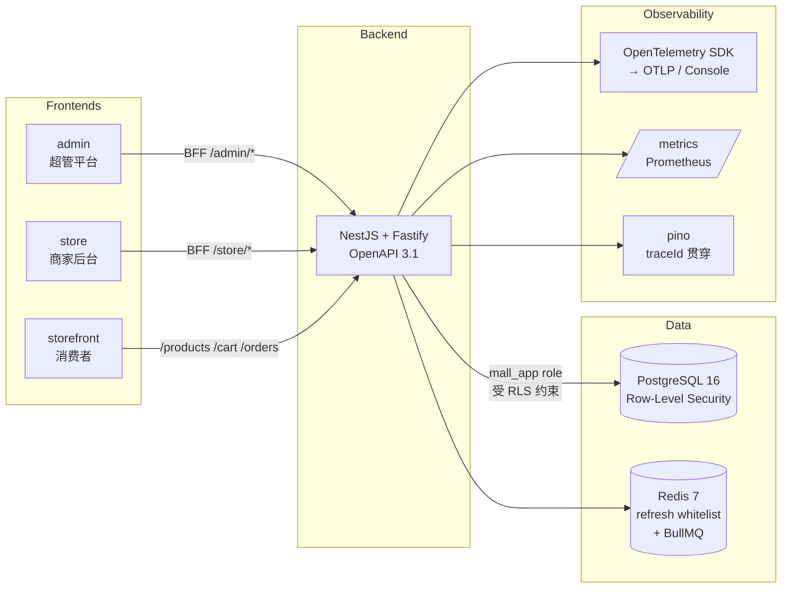

# mall-saas

> 多租户 SaaS 电商样板：NestJS 11 + Fastify + Prisma 7 + PostgreSQL RLS + 三前端（admin / store / storefront）+ W3C Trace Context + OpenTelemetry。

[](https://github.com/can4hou6joeng4/mall-saas/actions/workflows/ci.yml)
[](https://github.com/can4hou6joeng4/mall-saas/actions/workflows/release.yml)
[](./LICENSE)

一个面向小团队的多租户 SaaS 商城工程样板，强调**租户数据隔离（Row-Level Security）+ 可观测（trace 全链路贯穿）+ 端到端可验证**。

## 架构



## Tech Stack

| 层 | 选型 |
|----|------|
| 后端 | NestJS 11 · Fastify 5 · Prisma 7 · Zod 校验 · BullMQ 队列 · pino 结构化日志 |
| 鉴权 | JWT access + refresh 双 token · Redis whitelist · scope=tenant/platform 区分 |
| 数据隔离 | PG Row-Level Security + `mall_app` 非超管角色 · AsyncLocalStorage 透传 tenantId |
| 支付 | StripeProvider + MockProvider 抽象，HMAC webhook 签名 + 幂等回调 |
| 可观测 | W3C Trace Context（M24）· OpenTelemetry SDK + auto-instrumentation（M34） |
| i18n | Accept-Language → BusinessException 字典（M17）· storefront 中英文切换（M33） |
| 三前端 | Vite 6 + React 18 + TanStack Query + React Router 6 · openapi-typescript codegen |
| 构建 | pnpm workspace + turbo · ESLint + Prettier · exactOptionalPropertyTypes |
| 测试 | vitest（138 e2e + 单测）· Playwright（admin/store/storefront 浏览器级 4 用例） |
| CI | GitHub Actions · shellcheck · turbo cache · acceptance-smoke · GHCR release |
| 部署 | docker compose（postgres + redis + api + migrate stage）· `.env.prod.example` |

## Quickstart

依赖：Node 22+、pnpm 9+、Docker。

```bash
# 1. 起依赖（postgres + redis）
docker compose up -d

# 2. 装依赖 + 应用迁移
cp .env.example .env
pnpm install
pnpm --filter @mall/api exec prisma migrate deploy

# 3. 起后端
pnpm --filter @mall/api dev
# → http://localhost:3000/healthz
# → http://localhost:3000/docs（Swagger UI）
# → http://localhost:3000/metrics（Prometheus）

# 4. 起三前端（每个开新终端）
pnpm --filter @mall/admin dev       # http://localhost:5173
pnpm --filter @mall/store dev       # http://localhost:5174
pnpm --filter @mall/storefront dev  # http://localhost:5175
```

## 常用命令

| 命令 | 作用 |
|------|------|
| `pnpm test` | 全工作区单测 + 后端 e2e |
| `pnpm lint` | ESLint（max-warnings=0）|
| `pnpm typecheck` | TypeScript 严格模式 |
| `pnpm build` | 构建所有 workspace |
| `pnpm --filter @mall/storefront exec playwright test` | 浏览器级 e2e |
| `bash scripts/m{N}-acceptance.sh` | 单个里程碑端到端验收（M2~M34） |

## 部署

生产单机部署（docker compose）：

```bash
cp .env.prod.example .env.prod
# 填入强随机 JWT_SECRET / POSTGRES_PASSWORD / PAYMENT_MOCK_SECRET ...
docker compose -f docker-compose.prod.yml --env-file .env.prod up -d --build
```

镜像也会在每次推 `v*` tag 时自动构建并发布到 [GHCR](https://github.com/can4hou6joeng4/mall-saas/pkgs/container/mall-api)：

```bash
docker pull ghcr.io/can4hou6joeng4/mall-api:latest
```

## 多租户数据隔离（核心设计）

1. **JWT 携带 `tenantId`**——所有 tenant-scope 请求由 `Auth` 中间件解析后存入 AsyncLocalStorage。
2. **PG 角色双账号**：`mall`（superuser，跑迁移）/ `mall_app`（运行时，受 RLS 约束）。
3. **每张业务表都有 RLS policy**：`USING (tenant_id = current_setting('app.tenant_id')::int)`。
4. **每次事务前 `SET LOCAL app.tenant_id = $1`**（`PrismaService.withTenant()` 封装）。
5. 即使代码 bug 忘了 WHERE tenant_id，DB 层也会拒绝跨租户读写——**最后一道防线**。

## 里程碑链

完整 34 个里程碑（v0.2-m2 → v0.34-m34），每个都自带可复跑的 `scripts/m{N}-acceptance.sh`：

| 阶段 | 里程碑示例 |
|------|----------|
| 后端骨架（M2 - M10） | RLS · 多租户 · 商品 · 订单 · 支付 · JWT refresh |
| 业务能力（M11 - M17） | 购物车 · 预占库存 · Stripe · 优惠券 · 文件存储 · i18n |
| 三前端（M18 - M23） | admin Playwright · storefront · 401 自动 refresh · store 详情 · 消费者支付 |
| 可观测 & 部署（M24 - M30） | W3C trace · 生产 compose · admin tenant/payment 详情 · 用户管理 · GHCR release |
| 工程化（M31 - M34） | 优惠券拉通 · 三前端 Playwright · storefront i18n · OpenTelemetry SDK |

每个里程碑都遵循同一节奏：feature 分支 → 后端 + e2e → 前端 + jsdom → acceptance 脚本 → ff-merge → tag。

## 目录结构

```
.
├── apps/
│   ├── api/           NestJS 后端（OpenAPI 3.1, Prisma, BullMQ, OTel）
│   ├── admin/         超管平台前端
│   ├── store/         商家后台前端
│   └── storefront/    消费者前端（i18n 中英）
├── packages/
│   └── shared/        共享品牌类型（TenantId 等）
├── scripts/
│   └── m*-acceptance.sh  每个里程碑的端到端验收脚本
├── docker-compose.yml         dev 用：postgres + redis
├── docker-compose.prod.yml    prod 用：postgres + redis + migrate + api
└── .github/workflows/
    ├── ci.yml         shellcheck + 全工作区 + docker-smoke + acceptance-smoke
    └── release.yml    on push tag v* → 构建并推送 GHCR
```

## License

[MIT](./LICENSE) © 2026 can4hou6joeng4
