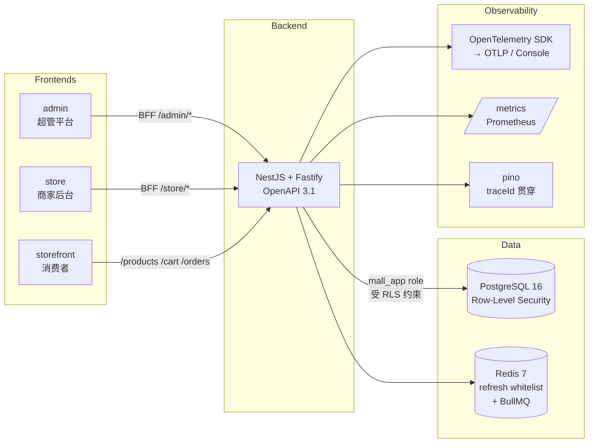

<div align="center">

# mall-saas

**多租户 SaaS 电商样板 · AI Agent 端到端可演进的工程参考**

> NestJS 11 + Fastify + Prisma 7 + PostgreSQL Row-Level Security · 三前端（admin / store / storefront）<br/>
> + W3C Trace Context + OpenTelemetry · 34 个里程碑 · 完整 CI/CD/可观测闭环

[](https://github.com/can4hou6joeng4/mall-saas/actions/workflows/ci.yml)
[](https://github.com/can4hou6joeng4/mall-saas/actions/workflows/release.yml)
[](https://github.com/can4hou6joeng4/mall-saas/actions/workflows/codeql.yml)
[](https://can4hou6joeng4.github.io/mall-saas/)
[](https://codecov.io/gh/can4hou6joeng4/mall-saas)
<br/>
[](./LICENSE)
[](https://github.com/can4hou6joeng4/mall-saas/releases)
[](https://github.com/can4hou6joeng4/mall-saas/stargazers)
[](https://github.com/can4hou6joeng4/mall-saas/pkgs/container/mall-api)
[](https://github.com/can4hou6joeng4/mall-saas/discussions)
[](https://github.com/can4hou6joeng4/mall-saas/issues?q=is%3Aissue+is%3Aopen+label%3A%22good+first+issue%22)
[](https://github.com/can4hou6joeng4/mall-saas/pulls)

[Quickstart](#-quickstart) · [架构](#-架构) · [Tech Stack](#%EF%B8%8F-tech-stack) · [部署](#-部署) · [多租户隔离](#-多租户数据隔离核心设计) · [里程碑链](#-里程碑链) · [Roadmap](./ROADMAP.md) · [相关项目](#-相关项目)

**中文** | [English](./README.en.md)

</div>

> 一个面向小团队的多租户 SaaS 商城工程样板，强调**租户数据隔离（Row-Level Security）+ 可观测（trace 全链路贯穿）+ 端到端可验证**。

---

## 💡 为什么用 mall-saas？

写新 SaaS 时，每次都要重做这些"看不见的地基"：多租户、RLS、JWT refresh、订单状态机、支付 webhook、库存预占、可观测、CI/CD。**mall-saas 把这套基础设施做完整给你看**：

- 📐 **生产级 RLS 多租户**：PG Row-Level Security + `mall_app` 非超管角色 + AsyncLocalStorage 双重隔离，DB 层做最后防线——即使代码 bug 忘了 `WHERE tenant_id` 也跨不了租户。
- 🔭 **可观测开箱即用**：W3C Trace Context（M24）+ OpenTelemetry SDK 自动 instrumentation（M34）+ pino traceId 贯穿 + `/metrics` Prometheus。
- 🛒 **三前端拉齐**：admin（超管） / store（商家） / storefront（消费者）共用 OpenAPI 类型 codegen + 401 自动 refresh + storefront i18n 中英双语。
- ✅ **每个里程碑可复跑**：34 个 `vX.Y.0-m{N}` tag，每个都附 `scripts/m{N}-acceptance.sh` 端到端验收脚本——CI 也跑同一份。
- 🚀 **生产部署一条龙**：`docker-compose.prod.yml` 双 stage 镜像 + `service_completed_successfully` 串联迁移 + 推 tag 自动 GHCR release（amd64 + arm64）。

> 适合谁：(1) 想看完整 SaaS 工程参考的开发者；(2) 起步多租户产品的小团队；(3) 学习 RLS / OTel / trace 一体化的工程实践者。

## 🧭 导航

[Quickstart](#-quickstart) · [架构](#-架构) · [Tech Stack](#%EF%B8%8F-tech-stack) · [常用命令](#-常用命令) · [部署](#-部署) · [多租户隔离](#-多租户数据隔离核心设计) · [里程碑链](#-里程碑链) · [目录结构](#-目录结构) · [贡献 & 路线图](#-贡献--路线图) · [相关项目](#-相关项目)

## 📐 架构



## 🛠️ Tech Stack

| 层 | 选型 |
|----|------|
| 后端 | NestJS 11 · Fastify 5 · Prisma 7 · Zod 校验 · BullMQ 队列 · pino 结构化日志 |
| 鉴权 | JWT access + refresh 双 token · Redis whitelist · scope=tenant/platform 区分 |
| 数据隔离 | PG Row-Level Security + `mall_app` 非超管角色 · AsyncLocalStorage 透传 tenantId |
| 支付 | StripeProvider + MockProvider 抽象，HMAC webhook 签名 + 幂等回调 |
| 可观测 | W3C Trace Context（M24）· OpenTelemetry SDK + auto-instrumentation（M34） |
| i18n | Accept-Language → BusinessException 字典（M17）· storefront 中英文切换（M33） |
| 三前端 | Vite 6 + React 18 + TanStack Query + React Router 6 · openapi-typescript codegen |
| 构建 | pnpm workspace + turbo · ESLint + Prettier · exactOptionalPropertyTypes |
| 测试 | vitest（138 e2e + 单测）· Playwright（admin/store/storefront 浏览器级 4 用例） |
| CI | GitHub Actions · shellcheck · turbo cache · acceptance-smoke · CodeQL · Codecov · GHCR release |
| 部署 | docker compose（postgres + redis + api + migrate stage）· `.env.prod.example` |

## 🚀 Quickstart

依赖：Node 22+、pnpm 9+、Docker。

```bash
# 1. 起依赖（postgres + redis）
docker compose up -d

# 2. 装依赖 + 应用迁移
cp .env.example .env
pnpm install
pnpm --filter @mall/api exec prisma migrate deploy

# 3. 起后端
pnpm --filter @mall/api dev
# → http://localhost:3000/healthz
# → http://localhost:3000/docs（Swagger UI）
# → http://localhost:3000/metrics（Prometheus）

# 4. 起三前端（每个开新终端）
pnpm --filter @mall/admin dev       # http://localhost:5173
pnpm --filter @mall/store dev       # http://localhost:5174
pnpm --filter @mall/storefront dev  # http://localhost:5175
```

> 📖 **在线 API 文档**：<https://can4hou6joeng4.github.io/mall-saas/>（GitHub Pages 自动跟随 `apps/api/openapi.json` 更新）

## 📚 常用命令

| 命令 | 作用 |
|------|------|
| `pnpm test` | 全工作区单测 + 后端 e2e |
| `pnpm test:coverage` | 同上 + v8 覆盖率（上传 Codecov） |
| `pnpm lint` | ESLint（max-warnings=0）|
| `pnpm typecheck` | TypeScript 严格模式 |
| `pnpm build` | 构建所有 workspace |
| `pnpm --filter @mall/storefront exec playwright test` | 浏览器级 e2e |
| `bash scripts/m{N}-acceptance.sh` | 单个里程碑端到端验收（M2~M34） |

## 🐳 部署

生产单机部署（docker compose）：

```bash
cp .env.prod.example .env.prod
# 填入强随机 JWT_SECRET / POSTGRES_PASSWORD / PAYMENT_MOCK_SECRET ...
docker compose -f docker-compose.prod.yml --env-file .env.prod up -d --build
```

镜像也会在每次推 `v*` tag 时自动构建并发布到 [GHCR](https://github.com/can4hou6joeng4/mall-saas/pkgs/container/mall-api)（amd64 + arm64 多架构）：

```bash
docker pull ghcr.io/can4hou6joeng4/mall-api:latest
```

## 🔒 多租户数据隔离（核心设计）

1. **JWT 携带 `tenantId`**——所有 tenant-scope 请求由 `Auth` 中间件解析后存入 AsyncLocalStorage。
2. **PG 角色双账号**：`mall`（superuser，跑迁移）/ `mall_app`（运行时，受 RLS 约束）。
3. **每张业务表都有 RLS policy**：`USING (tenant_id = current_setting('app.tenant_id')::int)`。
4. **每次事务前 `SET LOCAL app.tenant_id = $1`**（`PrismaService.withTenant()` 封装）。
5. 即使代码 bug 忘了 WHERE tenant_id，DB 层也会拒绝跨租户读写——**最后一道防线**。

## 🏁 里程碑链

完整 34 个里程碑（v0.2-m2 → v0.34-m34），每个都自带可复跑的 `scripts/m{N}-acceptance.sh`：

| 阶段 | 里程碑示例 |
|------|----------|
| 后端骨架（M2 – M10） | RLS · 多租户 · 商品 · 订单 · 支付 · JWT refresh |
| 业务能力（M11 – M17） | 购物车 · 预占库存 · Stripe · 优惠券 · 文件存储 · i18n |
| 三前端（M18 – M23） | admin Playwright · storefront · 401 自动 refresh · store 详情 · 消费者支付 |
| 可观测 & 部署（M24 – M30） | W3C trace · 生产 compose · admin tenant/payment 详情 · 用户管理 · GHCR release |
| 工程化（M31 – M34） | 优惠券拉通 · 三前端 Playwright · storefront i18n · OpenTelemetry SDK |

每个里程碑都遵循同一节奏：feature 分支 → 后端 + e2e → 前端 + jsdom → acceptance 脚本 → ff-merge → tag → GitHub Release。

📖 详细 release notes 见 [CHANGELOG.md](./CHANGELOG.md) 或 [Releases 页](https://github.com/can4hou6joeng4/mall-saas/releases)。

## 📂 目录结构

```
.
├── apps/
│   ├── api/           NestJS 后端（OpenAPI 3.1, Prisma, BullMQ, OTel）
│   ├── admin/         超管平台前端
│   ├── store/         商家后台前端
│   └── storefront/    消费者前端（i18n 中英）
├── packages/
│   └── shared/        共享品牌类型（TenantId 等）
├── scripts/
│   └── m*-acceptance.sh  每个里程碑的端到端验收脚本
├── docker-compose.yml         dev 用：postgres + redis
├── docker-compose.prod.yml    prod 用：postgres + redis + migrate + api
└── .github/workflows/
    ├── ci.yml         shellcheck + 全工作区 + docker-smoke + acceptance-smoke + Codecov
    ├── codeql.yml     代码安全扫描（每周一定时）
    ├── pages.yml      自动发布 Swagger UI 到 GitHub Pages
    └── release.yml    on push tag v* → 构建并推送 GHCR
```

## 🤝 贡献 & 路线图

- 想参与？读 [CONTRIBUTING.md](./CONTRIBUTING.md)。
- 行为准则：[CODE_OF_CONDUCT.md](./CODE_OF_CONDUCT.md)。
- 安全漏洞披露：[SECURITY.md](./SECURITY.md)。
- 未来方向：[ROADMAP.md](./ROADMAP.md)。
- 完整变更日志：[CHANGELOG.md](./CHANGELOG.md)。
- 喜欢这个项目？欢迎 [Star ⭐](https://github.com/can4hou6joeng4/mall-saas/stargazers) / [开 Discussion 💬](https://github.com/can4hou6joeng4/mall-saas/discussions) / 提 [Issue](https://github.com/can4hou6joeng4/mall-saas/issues/new/choose)。

## 🔗 相关项目

mall-saas 是 [@can4hou6joeng4](https://github.com/can4hou6joeng4) 围绕 **AI Agent + 工程化开源** 的一部分。以下是同体系下的其它项目：

| 项目 | 简介 | Stack |
|------|------|-------|
| [boss-agent-cli](https://github.com/can4hou6joeng4/boss-agent-cli) ⭐ | 专为 AI Agent 设计的 BOSS 直聘双端 CLI——schema 驱动 · JSON 信封 · 求职/招聘工作流 · MCP 集成 · AI 简历优化 | Python · MCP |
| [OpenCLI](https://github.com/can4hou6joeng4/OpenCLI) | 让任意网站 / Electron / 本地工具变成 AI Agent 可发现 + 可调用的 CLI（AGENT.md 一体化） | JavaScript |
| [TokenIsland](https://github.com/can4hou6joeng4/TokenIsland) | macOS 灵动岛实时展示 Claude Code / Codex CLI agent 状态与今日 token 消耗 | Swift |
| [landing-craft](https://github.com/can4hou6joeng4/landing-craft) | Claude Code skill：57 套城市灵感设计 + GSAP 动效，一键生成视觉冲击力强的 Landing Page | HTML |
| [legal-extractor](https://github.com/can4hou6joeng4/legal-extractor) | 法律文书智能提取工具 | Go |
| [@can4hou6joeng4](https://github.com/can4hou6joeng4) | 个人主页：AI Agent Developer · Full Stack Engineer · Open Source Maintainer | — |

> 想看作者完整 portfolio：<https://developer-portfolio-opal-six.vercel.app>

## 📄 License

[MIT](./LICENSE) © 2026 [can4hou6joeng4](https://github.com/can4hou6joeng4)
